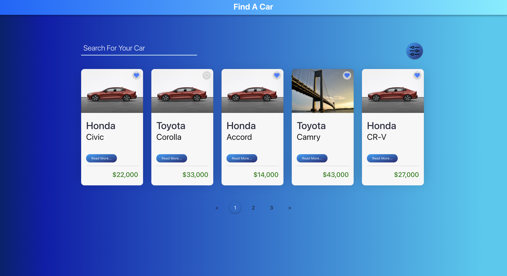
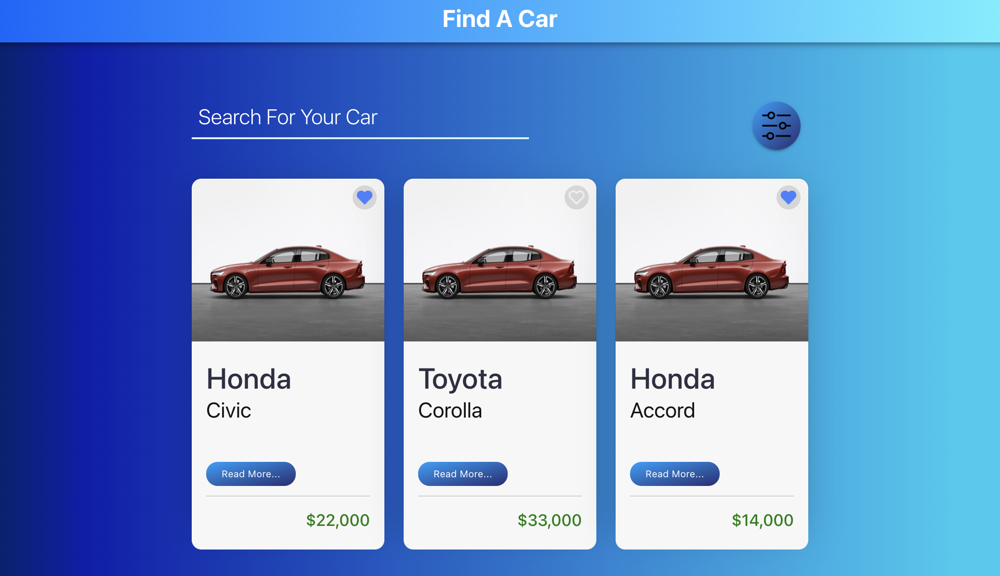
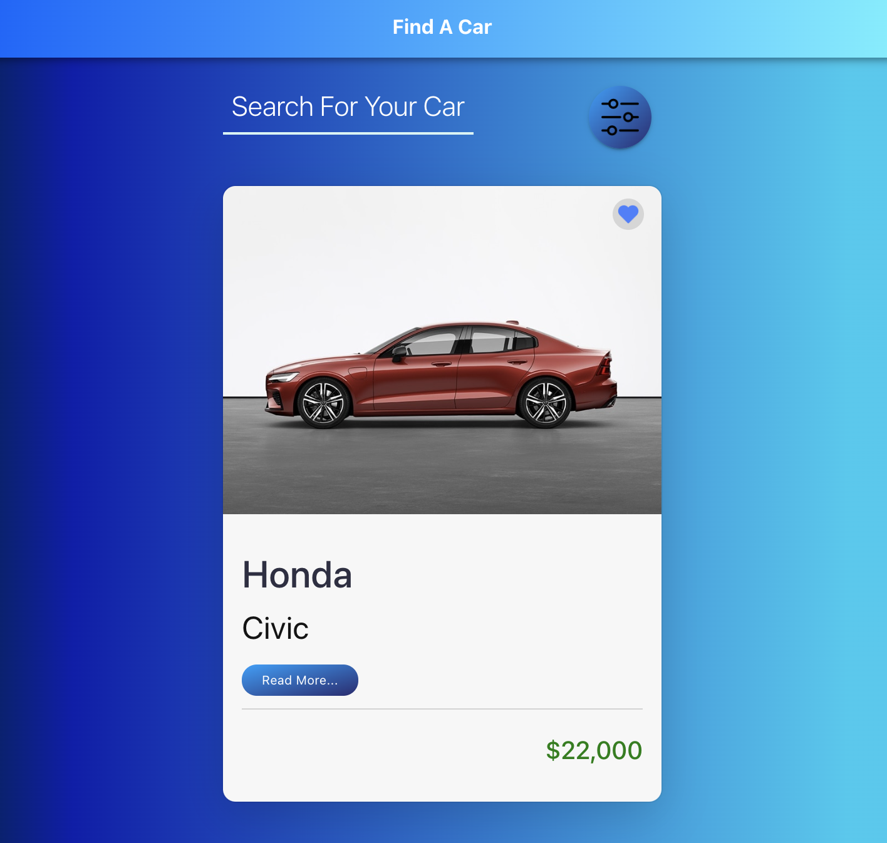
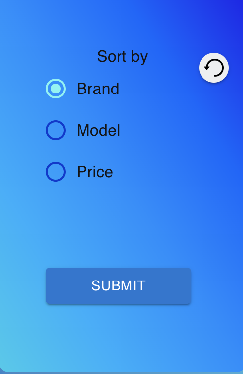

# Find-A-Car

## Front-end coding test using React.js

Desing for an app to search for new and used cars.

Below you can see new design for Desktop, Tablet and Mobile.

## Desktop



### Tablet



### Mobile



### Sorting Options



### Pagination


### Notifications


### 404 Page Handling


The data required to render the design is under `src/api/cars.json` folder. The
data looks like this:

```json
[
  {
    "id": "1",
    "heading": "Honda",
    "subheading": "Civic",
    "price": 22000,
    "description": "Lorem Ipsum is simply dummy text of the printing...",
    "favorites": false
  }
]
```

## Requirements

- Page should resemble the comp. If front end/CSS framework you choose has
  components that resemble but do not exactly match comp, that is fine
- Data should be fed by included JSON.
- Page should be responsive, demonstrating change in layout between at least two
  breakpoints.

## Extra Points:

- Ability to sort based off Heading, Subheading, or Price.
- Limit Cards to one row while preserving number of columns, then add pagination
  to see other results.
- Feature to search based on Heading or Subheading
- Modal window to get more specific information about the car
- Ability to add/romeve car to favorites by clicking on the heart image
- Notifications added as well

## Technology:

- A CSS preprocessor and front end/CSS framework are encouraged. We currently
  use SASS and a derivation of Bootstrap.
- Page should use JavaScript to generate core markup, preferably using a
  JavaScript
- Framework. We currently use ReactJS but feel free to use any that you are
  familiar with (ie Mustache, Angular, Ember, Vue … )
